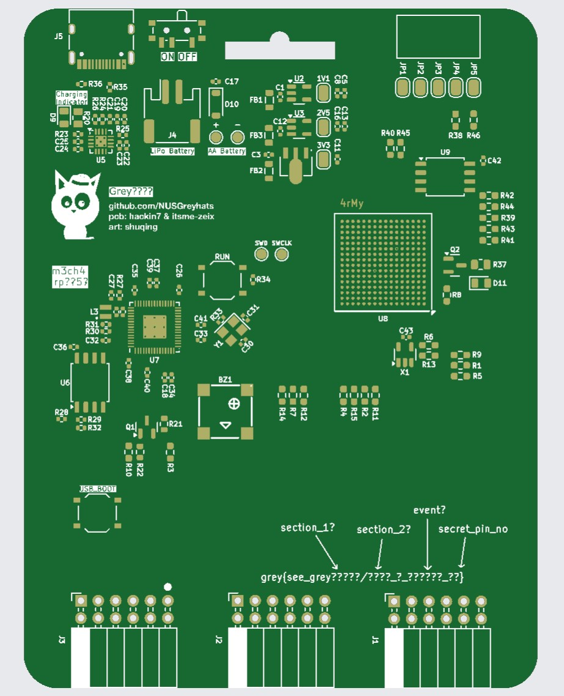
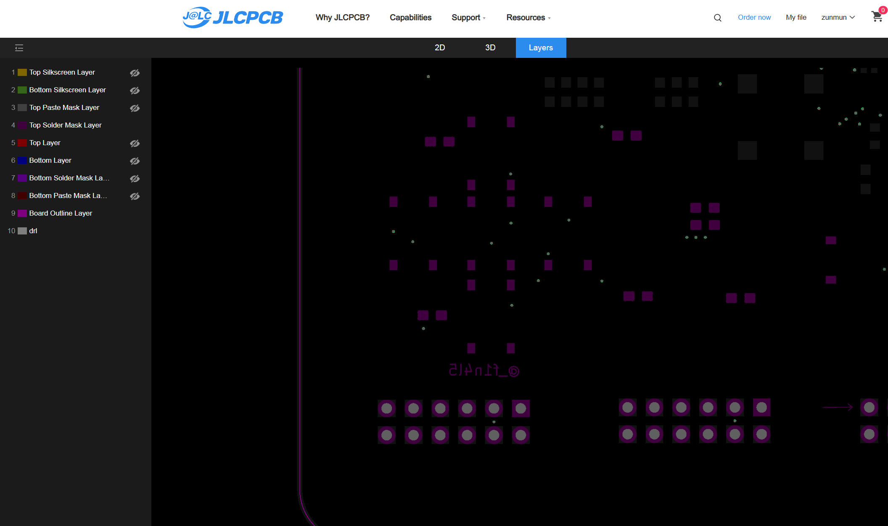

# Secret Development Kit

# Details

You have just stolen top secret production files of a secret board. Hmm, I wonder what it could be?

# Author

Hackin7

# Solution

1. Open Gerber files, be greated by clown silkscreen
2. Look at back silkscreen to get rough flag format
3. Section 1: guess `m3ch4` (in back silkscreen)
4. Section 2: look at back solder mask 
	1. and see `4rMy`
5. Section 3: Hidden on front solder mask
	1. JLCPCB and KiCAD both overwrite it so need to hide the silkscreen
	2. `@_f1n4l5`
6. Secret Pin Number
	1. From back silkscreen, guess the chip is rp2350
	2. Either see the dot or the arrow in the front solder mask to identify the pin on the connector
		1. trace the secret pin to the chip to find out it is pin 25
    2. Alternative (Expected for newcomer) solution: brute force flag (100 combinations)

# Learning objectives

1. Learn open up gerber files. 
2. Understand that solder mask layer can be hidden by silk screen. 
3. Either bruteforce flag/ trace the PCB pins.
4. Teaser for GreyMecha/Army

# Flag

`grey{see_greym3ch4/4rMy_@_f1n4l5_25}`

